> {width="6.6875in"
> height="0.8013888888888889in"}

{width="5.6361100174978125in"
height="3.75in"}

> **Final Project: School Management System** Written by:
>
> **Ben Morales**
>
> **Mohamed Abbas**
>
> **Raoul Nya**

**DATABASE SYSTEMS - FALL 2023**

School Management System

2

> **GOALS**\
> In today\'s fast-paced educational landscape, the demand for
> efficient, user-friendly, and comprehensive school management systems
> has never been greater. Our School Management System Project is
> designed to meet this demand by delivering a versatile platform that
> streamlines administrative tasks, enhances communication, and fosters
> an environment of collaborative learning.
>
> The intended use of our School Management System is to collect and
> manipulate a wide collection of data from students, instructors, and
> the school itself in order to provide real-time updates on academic
> progress, and to both simplify and automate aspects within educational
> management to improve efficiency, minimize human error, and ultimately
> to allow educators to put more focus on teaching rather than paperwork
> and the structuring of classes.
>
> The intended users of this database system include students,
> instructors, administrative staff, and faculty leadership. Students
> mainly benefit from accessing class schedules, registering for
> classes, viewing academic records, tracking attendance and managing
> personal information. Instructors or professors use it to manage
> courses, view student rosters, enter grades, schedule courses, and
> access academic resources. University administrative staff manage
> admissions, manage student records, assign classrooms, coordinate
> schedules, and generate reports on

School Management System

3

> academic performance and institutional statistics. Faculty management
> uses the system to manage the physical infrastructure of the
> university, including classrooms, lecture halls, laboratories and
> other facilities, schedule maintenance, track equipment and manage
> room assignments for the class.
>
> The database system offers a variety of services tailored to the needs
> of its users. These include course management, where students can
> search, register for courses, view their course schedules, and access
> course information. Classroom management focuses on the efficient
> allocation of classrooms for different courses and academic
> activities. Resource coordination involves the coordination of
> resources for academic purposes, such as laboratories, equipment, and
> library materials. Reporting and analytics is also a key service,
> enabling reporting on student performance, enrollment statistics and
> other relevant institutional data.

School Management System

4

**DATABASE DESIGN AND DATA**

> Our School Management System will compare and transform collected data
> of instructors, students, and the classes held between the two. Data
> such as students' majors and years, instructors' departments and
> degrees, will be collected. Students and instructors will be connected
> by the classes that they attend and teach respectively. With the
> design structured as such, it will be easier to determine and retrieve
> relevant information about the current academic pathways both parties
> are taking.
>
> **- Entity-Relationship Diagram (ERD)**
>
> 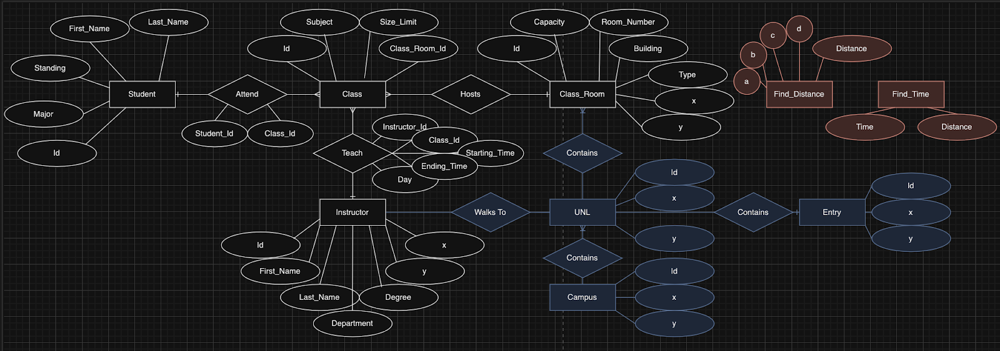{width="6.6986100174978125in"
> height="2.3652777777777776in"}
>
> This entity-relationship diagram (ERD) provides a comprehensive visual
> representation of the database structure of our academic management
> system. It delineates the complex relationships between various
> entities such as students, classes, instructors, and classrooms. Each
> entity is symbolized by a set of

School Management System

5

> attributes, illustrating the data we collect and maintain to support
> our educational goals. The ERD serves as a blueprint for database
> design, ensuring that the system accurately reflects the complex
> operations of our academic institution. It facilitates efficient
> organization of information and supports features required by
> students, faculty, and administrative staff.
>
> **- Tables**
### Student, Class, Instructor, Instructor_Location, Class_Room
| Student    | Class         | Instructor    | Instructor_Location | Class_Room   |
|------------|---------------|---------------|---------------------|--------------|
| Id         | Id            | Id            | Id                  | Id           |
| First_Name | Subject       | First_Name    | x                   | Capacity     |
| Last_Name  | Size_Limit    | Last_Name     | y                   | Room_Number  |
| Major      | Class_Room_Id | Department    |                     | Building_Id  |
| Standing   |               | Degree        |                     | Type         |
| x          | x             |               |                     |              |
| y          | y             |               |                     |              |

### Teach, Attend
| Teach         | Attend        |
|---------------|---------------|
| Instructor_Id | Instructor_Id |
| Student_Id    | Student_Id    |
| Class_Id      | Class_Id      |
| Class_Id      | Class_Id      |
| Day           |               |
| Starting_Time |               |
| Ending_Time   |               |

### Campus UNL Entry
| Campus | UNL | Entry |
|--------|-----|-------|
| id     | id  | id    |
| x      | x   | x     |
| y      | y   | y     |

### Find_Distance
| Find_Distance |          |
|---------------|----------|
| a             | distance |
| b             | time     |
| c             |          |
| d             |          |
| distance      |          |

> **- Data in MLPQ**\
> All entities and functions unselected:

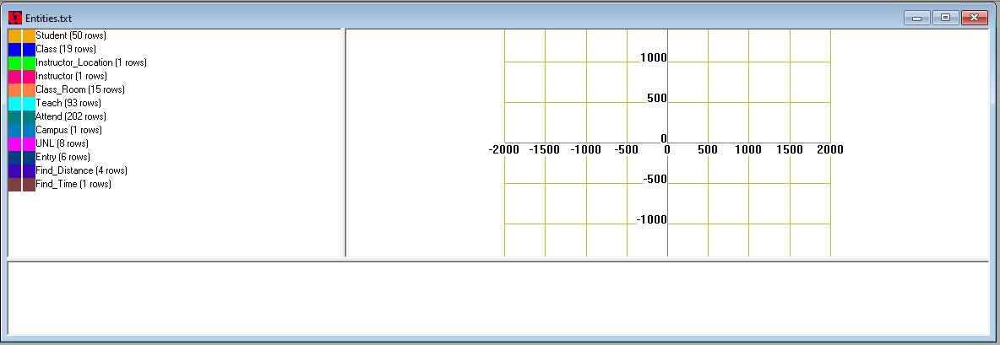{width="6.5in"
height="2.25in"}

> Dummy data for "Student" entity:

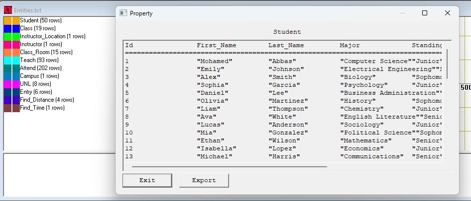{width="6.5in"
height="2.7819444444444446in"}

> Dummy data for "Class" entity:
>
> School Management System\
> 7

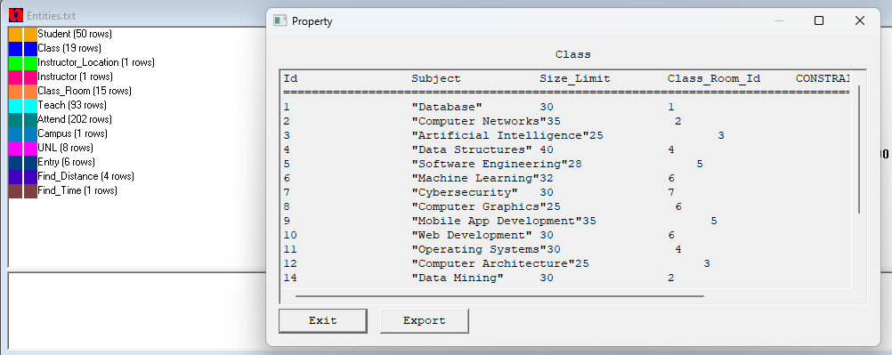{width="6.5in"
height="2.5833333333333335in"}

> Dummy data for "Class_Room" entity:

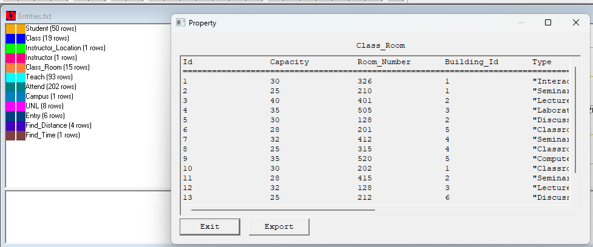{width="6.5in"
height="2.7083333333333335in"}

> Dummy data for "Teach" relational entity:

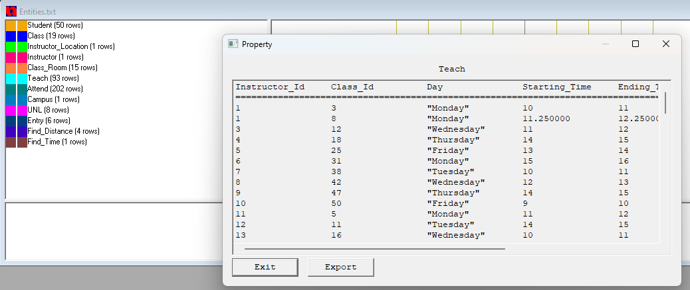{width="6.5in"
height="2.7402777777777776in"}

> School Management System\
> 8
>
> Dummy data for "Attend" relational entity:

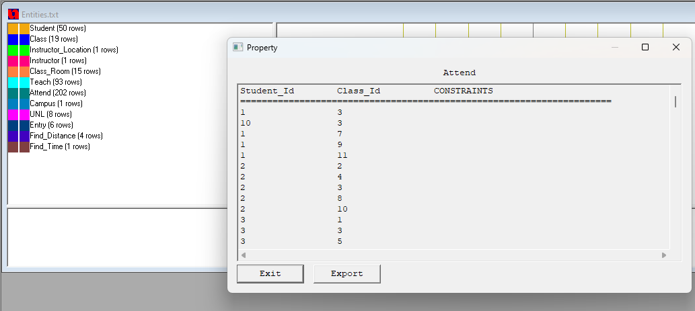{width="6.5in"
height="2.9166666666666665in"}

Constraint visualizations of "Campus" and "UNL" constraint entities:

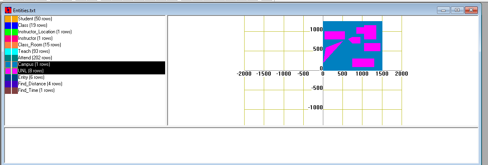{width="6.5in"
height="2.2083333333333335in"}

> Constraint tables for "UNL" entity buildings:
>
> School Management System\
> 9

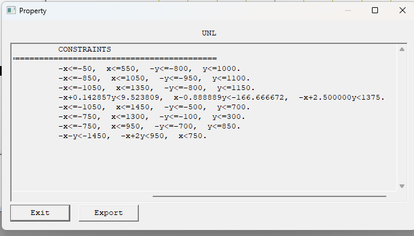{width="6.5in"
height="3.7083333333333335in"}

"Entry" tables showcasing IDs and coordinates of building entrances:

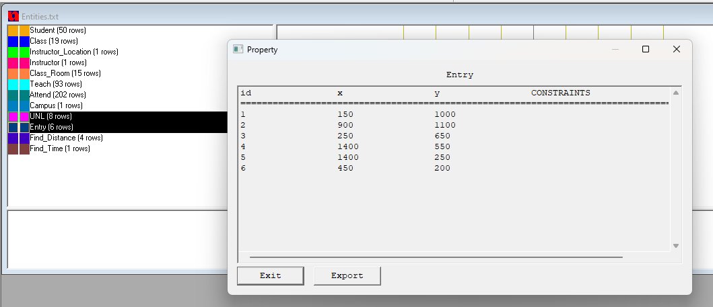{width="6.5in"
height="2.801388888888889in"}

> "Find_Distance" function table showing the utilization of entry point
> coordinates to determine distance between two buildings:
>
> School Management System\
> 10

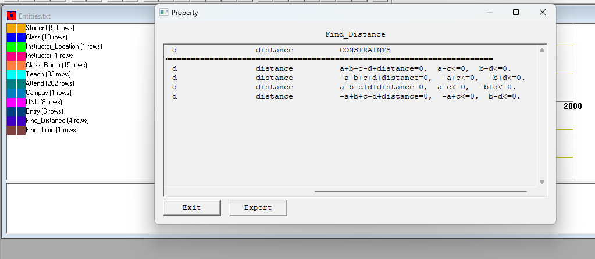{width="6.5in"
height="2.8333333333333335in"}

> "Find_Time" function table showing the estimation of how much time
> will pass for the average person to walk a given distance. Average
> walking speed set at 80 m/s:

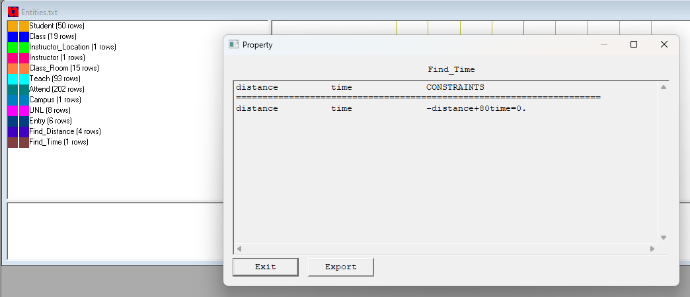{width="6.5in"
height="2.801388888888889in"}

> Constraint mapping of campus and buildings (in meters):

School Management System

11

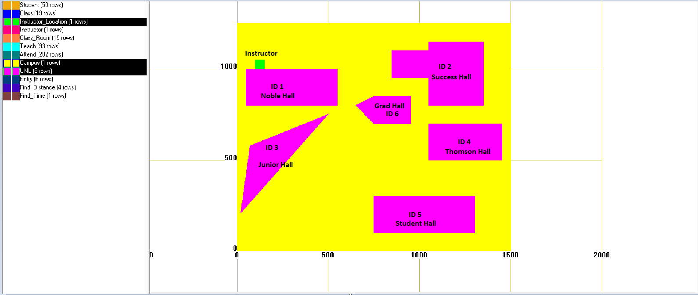{width="6.5in"
height="2.75in"}

> **FUNCTIONS AND IMPLEMENTATION**\
> We defined three high-level functions that can help our end-users:\
> **- Function One: Time-Distance Estimation**\
> Through queries and functions, our database can determine the
> approximate time an instructor will make it from one given classroom
> to another.
>
> Through the data our database collects, one can find the class IDs of
> all classes a specific instructor teaches:

School Management System

12

>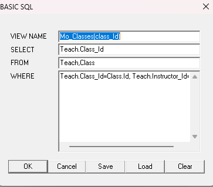

>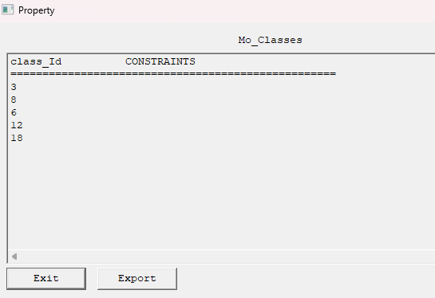

+===================================+===================================+
+-----------------------------------+-----------------------------------+

> In addition to those class IDs, one can also find the day, start time,
> and end time those classes take place:

+-----------------------------------+-----------------------------------+
>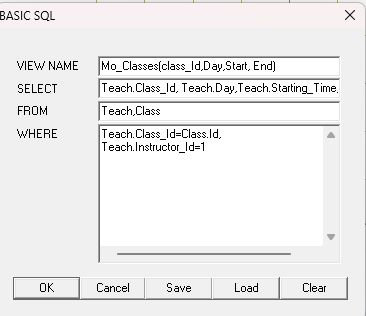
>>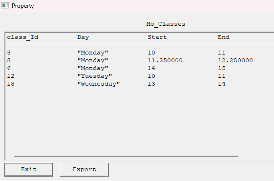
+===================================+===================================+
+-----------------------------------+-----------------------------------+

> One can then find the desired classroom IDs for the two classes they
> wish to estimate the time it will take the instructor that teaches
> both to make it from one to the next:
>
> School Management System\
> 13

+-----------------------------------+-----------------------------------+
>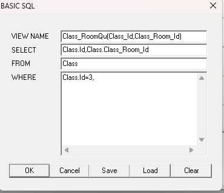
>>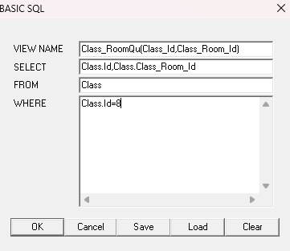
+===================================+===================================+
+-----------------------------------+-----------------------------------+

+-----------------------------------+-----------------------------------+
>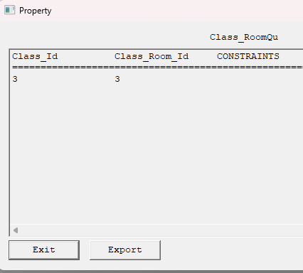
>>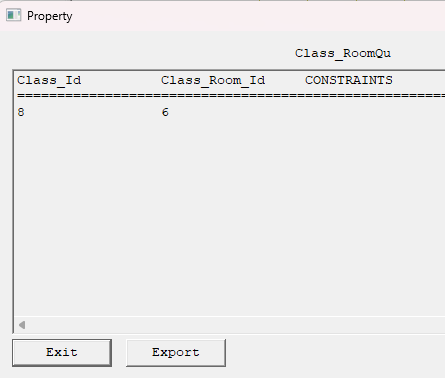
+===================================+===================================+
+-----------------------------------+-----------------------------------+

> With the classroom IDs determined, one can then find their respective
> building IDs:

+-----------------------------------+-----------------------------------+
>
>>
+===================================+===================================+
+-----------------------------------+-----------------------------------+

School Management System

14

+-----------------------------------+-----------------------------------+
>
>>
+===================================+===================================+
+-----------------------------------+-----------------------------------+

> With the buildings determined, the user can then use the x and y
> positions of the two desired buildings' entry points within the
> Find_Distance function to find the distance in meters:

+-----------------------------------+-----------------------------------+
>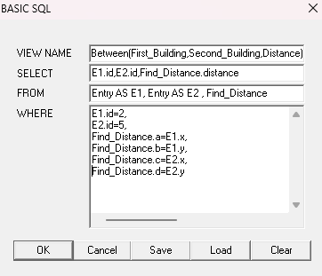
>>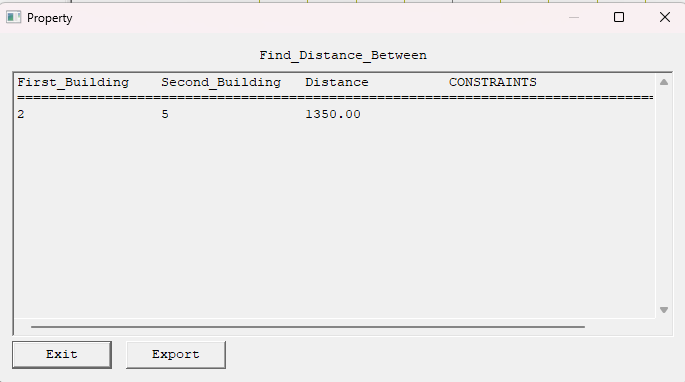
+===================================+===================================+
+-----------------------------------+-----------------------------------+

> Then, that found distance can be input into the Find_Time function to
> approximate the time it would take the instructor to go from one
> classroom to another in minutes.

School Management System

15

+-----------------------------------+-----------------------------------+
>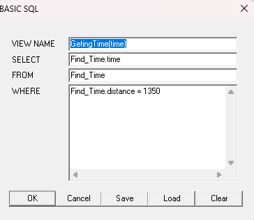
>>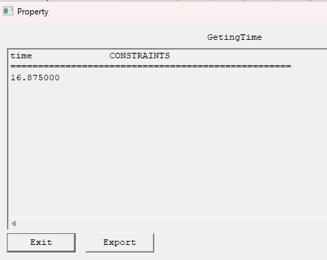
+===================================+===================================+
+-----------------------------------+-----------------------------------+

> In this case, it is determined that the instructor moving from class
> **ID 3** and class **ID 8** will make it from one classroom to the
> next in approximately **16.875 minutes** . Seeing that the end time of
> the first class and the start time of the second class is a 15 minute
> timeframe, it would be advisable to reschedule the instructor's taught
> classes so as to better accommodate his or her ability to make it to
> each class on time.
>
> **- Function Two: Office-Building Locating**\
> The UNL constraint entity (of which would differ and have a different
> name for different locations) maps the layout of each building on
> campus. Using the x and y coordinates of an instructor's office, the
> ID of the building the office is located can be determined:

School Management System

16

+-----------------------------------+-----------------------------------+
>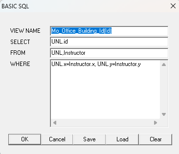
>>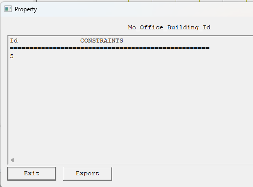
+===================================+===================================+
+-----------------------------------+-----------------------------------+

> **- Function Three: Student Schedule Listing**\
> Through the data collected for the database, a student's schedule can
> efficiently be queried. One can easily find all class IDs of any given
> student:

+-----------------------------------+-----------------------------------+
>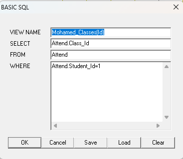
>>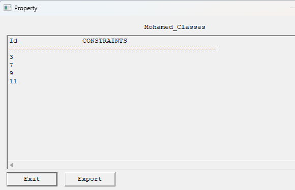
+===================================+===================================+
+-----------------------------------+-----------------------------------+

> With more depth, schedules with class names, start and end times, and
> the day of each class can all be shown together:
>
> School Management System\
> 17

+-----------------------------------+-----------------------------------+
>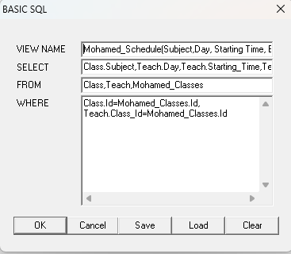
>>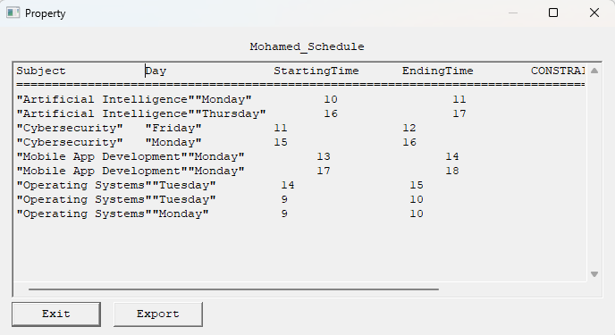
+===================================+===================================+
+-----------------------------------+-----------------------------------+
